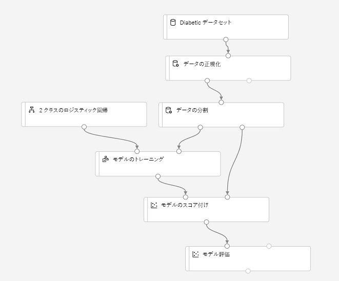

# ラボ 2A: Azure ML Designer を使用したトレーニング パイプラインの作成

*Designer* インターフェイスは、ワークフロー、またはデータ インジェスト、変換、モデル トレーニング モジュールの*パイプライン* を定義して、機械学習モデルを作成できるドラッグ アンド ドロップ環境を提供します。その後、このパイプラインを、クライアント アプリケーションが *推論* (新しいデータから予測を生成する) に使用できる Web サービスとして公開できます。

> **注**: Azure Machine Learning Designer は、執筆時点では *プレビュー*段階にあります。予期しないエラーが発生する場合があります。

## 開始する前に

このラボを開始する前に、このラボで使用する Azure Machine Learning ワークスペースと他のリソースを作成するタスクを含む[ラボ 1A](Lab01A.md) と [ラボ 1B](Lab01B.md) を完了させてください。

次にワークスペースの [Azure Machine Learning Studio](https://ml.azure.com) の**コンピューティング** ページの **トレーニング クラスター** タブで、前に作成した **aml-cluster** コンピューティング先を開き、**編集** をクリックします。その後、**ノードの最小数**設定を **1** に設定し、**更新**をクリックします。これにより、ラボ中にパイプラインを実行する時間が短縮されます。

## タスク 1: Designer パイプラインの作成とデータの探索

Designer を使用するには、まずパイプラインを作成し、作業するデータセットを追加する必要があります。

1. ワークスペースの [Azure Machine Learning Studio](https://ml.azure.com) で、**Designer** ページを表示し、新しいパイプラインを作成します。
2. **設定**ウィンドウで、既定のパイプライン名 (**パイプライン-作成*日***) を**ビジュアル糖尿病トレーニング**に変更します (**設定**ウィンドウが表示されない場合は、上部のパイプライン名の横にある **&#9881;** アイコンをクリックします)。
3. パイプラインを実行するコンピューティング先を指定する必要があることに注意してください。**設定**ウィンドウで、**コンピューティング先の選択** をクリックし、以前のラボで作成した **aml-cluster** コンピューティング先を選択します。
4. Designer の左側で、**データセット** セクションを展開し、前の演習で作成した**糖尿病データセット** データセットをキャンバスにドラッグします。
5. キャンバス上の**糖尿病データセット**モジュールを選択し、その設定を表示します。次に**出力**タブで、**視覚化**アイコン (縦棒グラフのように見えます) をクリックします。
6. データのスキーマを確認します。さまざまな列の分布をヒストグラムとして表示できます。次に、視覚化を閉じます。

## タスク 2: 変換の追加

モデルをトレーニングする前に、通常、データにいくつかの前処理変換を適用する必要があります。

1. 左側のウィンドウで、**データ変換**セクションを展開します。これには、モデルをトレーニングする前にデータを変換して前処理するために使用できる幅広いモジュールが含まれています。**データの正規化**モジュールを、**糖尿病データセット** モジュールの下のキャンバスにドラッグします。次に、**糖尿病データセット** モジュールからの出力を**データの正規化**モジュールの入力に接続します。
2. **データの正規化**モジュールを選択し、その設定を表示します。変換方法と変換する列を指定する必要があります。その後、変換を **ZScore** のままにして、次の列名を含む列を編集します。
    * PlasmaGlucose
    * DiastolicBloodPressure
    * TricepsThickness
    * SerumInsulin
    * BMI
    * DiabetesPedigree

    **注**: 数値列を正規化して同じスケールにし、大きい値を含む列がモデルのトレーニングに大きな影響を及ぼさないようにしています。通常、このような前処理変換の全体を適用して、トレーニング用のデータを準備しますが、この演習では簡単な作業を行います。

3. これで、トレーニングと検証のためにデータを個別のデータセットに分割する準備ができました。左側のウィンドウの**データ変換**セクションで、**データの分割**モジュールを**データの正規化**モジュールの下のキャンバスにドラッグします。次に、**データの正規化**モジュールの*変換済データセット* (左) を**データの分割**モジュールの入力に接続します。
4. **データの分割**モジュールを選択し、次のように設定します。
    * **分割モード** 行の分割
    * **最初の出力データセットの行の割合**: 0.7
    * **ランダム シード**: 123
    * **層化分割**: False

## タスク 3: モデル トレーニング モジュールの追加

データを準備し、トレーニング データセットと検証データセットに分割したら、パイプラインを構成してモデルをトレーニングおよび評価する準備が整います。

1. 左側のウィンドウで**モデル トレーニング** セクションを展開し、**モデルのトレーニング** モジュールを**データの分割**モジュールの下のキャンバスにドラッグします。次に、**データの分割**モジュールの*結果データセット 1* (左) 出力を**モデルのトレーニング**モジュールの*データセット* (右) 入力に接続します。
2. トレーニング中のモデルは**糖尿病**の値を予測するため、**モデルのトレーニング** モジュールを選択し、その設定を変更して、**ラベル列**を**糖尿病**に設定します (大文字と小文字とスペルを正確に一致させます)。
3. モデルが予測する**糖尿病**ラベルはバイナリ列 (糖尿病患者の場合は 1、そうでない患者の場合は 0) であるため、*分類*アルゴリズムを使用してモデルをトレーニングする必要があります。**機械学習アルゴリズム** セクションを展開し、**分類**の下で、**2 クラスのロジスティック回帰**モジュールをキャンバスにドラッグし、**データの分割**モジュールの左側、**モデルのトレーニング** モジュールの上にドラッグします。次に、その出力を**モデルのトレーニング** モジュールの**未訓練モデル** (左) 入力に接続します。
4. トレーニング済みモデルをテストするには、元のデータを分割するときに元に戻した検証データセットをスコアリングするために使用する必要があります。**モデルのスコアリング評価**セクションを展開し、**モデルのトレーニング** モジュールの下のキャンバスに**モデルのスコアリング** モジュールをドラッグします。次に、**モデルのトレーニング** モジュールの出力を**モデルのスコアリング** モジュールの**トレーニング済みモデル** (左) 入力に接続し、**データの分割**モジュールの**結果データセット 2** (右) 出力を**モデルのスコアリング** モジュールの**データセット** (右) 入力にドラッグします。
5. モデルのパフォーマンスを評価するには、検証データセットのスコアリングによって生成されるメトリックを調べる必要があります。**モデルのスコアリングと評価**セクションから、**モデルのスコアリング** モジュールの下のキャンバスに**モデルの評価**モジュールをドラッグし、**モデルのスコアリング** モジュールの出力を**モデルの評価**モジュールの**データセットのスコアリング** (左) 入力に接続します。

## タスク 4:  トレーニング パイプラインの実行

データ フロー ステップを定義したら、トレーニング パイプラインを実行してモデルをトレーニングする準備が整います。

1. パイプラインが次のようになっていることを確認します (画像には各モジュールのコメントが含まれており、それらが何をしているかを文書化しています - 実際のプロジェクトに Designer を使用する場合は、この操作を行うのも悪い考えではありません)。

    

2. 右上の**実行**をクリックします。次に、プロンプトが表示されたら、**visual-training**という名前の新しい*実験*を作成し、実行します。  これにより、コンピューティング先が初期化され、パイプラインが実行されます。実行には10分以上かかる場合があります。デザイン キャンバスの右上で、パイプライン実行の状態を確認できます。

    **ヒント**: 実行中は、**パイプライン**および**実験**ページで作成されたパイプラインと実験を表示できます。完了したら、**Designer** ページの**ビジュアル糖尿病トレーニング** パイプラインに切り替えます。

3. **データの正規化** モジュールが完了したら (&#x2705; アイコンで示されます)、それを選択し、**設定**ウィンドウの**出力 + ログ** タブの**変換済みデータセット** セクションの **ポート出力**で、**視覚化**アイコンをクリックします。変換された列の統計情報と分布の視覚化を表示できます。
4. **データの正規化**の視覚化を閉じ、設定ウィンドウを閉じるかサイズを変更し ([X] または **&#8599;&#8601;** アイコンをクリックし)、残りのモジュールが完了するまで待ちます。次に、**モデルの評価**モジュールの出力を視覚化して、モデルのパフォーマンス メトリックを確認します。

    **注**: このモデルのパフォーマンスはそれほど優れているわけではありません。その一因としては、最小限の機能エンジニアリングと前処理のみを実行したことが考えられます。いくつかの異なる分類アルゴリズムを試して結果を比較することができます (**データ分割** モジュールの出力を複数の**モデルのトレーニング** モジュールと **モデルのスコアリング** モジュールに接続 し、2 番目にスコアリングしたモデルを**モデルの評価**モジュールに接続して並べて比較できます)。演習のポイントは、完璧なモデルをトレーニングすることではなく、単に Designer のインターフェイスを紹介することです。
