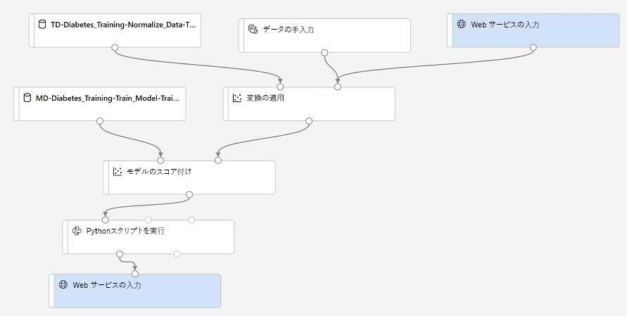

# ラボ 2B: Azure ML Designer を使用したサービスのデプロイ

トレーニング済みのモデルができたので、トレーニング パイプラインを使用して、新しいデータをスコアリングするための推論パイプラインを作成できます。

> **注**: Azure Machine Learning Designer は、執筆時点では*プレビュー*段階にあります。予期しないエラーが発生する場合があります。

## 開始する前に

このラボを開始する前に、このラボで使用する Azure Machine Learning ワークスペースと他のリソースを作成するタスクを含む[ラボ 1A](Lab01A.md) と[ラボ 1B](Lab01B.md) を完了させてください。また、このラボで使用する Designer トレーニング パイプラインを作成するタスクを含む[ラボ 2A](Lab02A.md) を完了させてください。

## タスク 1: 推論コンピューティングを準備する

このラボでは、Azure Kubernetes サービス (AKS) クラスターのコンテナー化されたサービスとして推論パイプラインを公開します。AKS クラスターは初期化に時間がかかるため、推論パイプラインを準備する前にプロセスを開始します。

1. [Azure Machine Learning Studio](https://ml.azure.com) のワークスペースの「**コンピューティング**」ページで、各タブの下にある既存のコンピューティング先を確認します。これらには、次の内容が含まれます。
    * **コンピューティング インスタンス**: 前のラボで作成したコンピューティング インスタンス。
    * **コンピューティング クラスター**: 前のラボで作成したコンピューティング先。
    * **推論クラスター**: なし (未作成)
    * **接続されたコンピューティング**: なし (ここは、ワークスペースの外部に存在する仮想マシンまたは Databricks クラスターを接続できる場所です)

2. コンピューティング インスタンスが実行されていない場合は、**コンピューティング インスタンス** タブで起動します。このラボの後半で使用します。

3. **推論クラスター** タブで、次の設定を使用して新しいクラスターを追加します。
    * **コンピューディング名**: *一意の名前を入力する*
    * **Kubernetes サービス**: 新規作成
    * **リージョン**: 任意の利用可能な地域を選択します
    * **仮想マシンのサイズ**: Standard_DS2_v2 (*フィルターを使用して一覧内でこれを検索します*)
    * **クラスターの目的**: 開発テスト
    * **ノード数**: 120
    * **ネットワークの構成**: Basic
    * **SSL 構成を有効にする**: 未選択

    > **注記**: Azure サブスクリプションには、プロビジョニングできるコアの数に制限があり、地域の制限が追加される場合があります。このラボでは、**Dev-test** クラスターを使用して、運用環境クラスターの最小コア数が 12 未満のクラスターにエンドポイントを展開することと、ノードごとに 2 つのコアを含む **Standard_DS2_v2** 仮想マシン サイズを使用して、2 つのノードが 4 つのコアのみを使用するようにすることが重要です。

4. コンピューティング先が*作成中*状態になっていることを確認し、次のタスクに進みます。定期的に戻ってこのページを更新し、クラスターが作成されていることを確認します。

    > **注**: AKS クラスターの作成には、かなりの時間がかかることがあります。作成中にエラーが発生した場合は、障害が発生したクラスターを削除し、別のリージョンを使用して再試行します。

## タスク 2: 推論パイプラインの作成

推論コンピューティングをプロビジョニングしている間に、推論パイプラインをデプロイ用に準備できます。

1. **デザイナー** ページで、前のラボで作成した**ビジュアル糖尿病トレーニング** パイプラインを開きます。
2. 右上の**推論パイプラインの作成**ドロップダウン リストで、**リアルタイム推論パイプライン**をクリックします。数秒後、**ビジュアル糖尿病トレーニング-real time inference(リアルタイム推論)** という名前のパイプラインの新しいバージョンが開きます。
3. 新しいパイプラインの名前を**糖尿病の予測**に変更し、新しいパイプラインを確認します。一部の変換手順とトレーニング手順は、トレーニング データの統計情報を使用して新しいデータ値を正規化し、トレーニング済みのモデルを使用して新しいデータをスコアリングするために使用されるように、このパイプラインにカプセル化されています。
4. 推論パイプラインでは、新しいデータが元のトレーニング データのスキーマと一致するものと仮定されるため、トレーニング パイプラインの**diabetes dataset(糖尿病データセット)** データセットが含まれていることに注意してください。しかし、この入力データには、モデルが予測する **Diabetic(糖尿病)** ラベルが含まれており、糖尿病の予測がまだ行われていない新しい患者データに含めることは不自然です。
5. この **糖尿病データセット**モジュールを推論パイプラインから削除し、**「データの入力と出力」** セクションの**データの手動入力**モジュールに置き換えます。これにより、**Web サービス入力**と同じように、**変換の適用**モジュールの**データセット**入力に接続します。次に、**データの手動入力**モジュールの設定を変更し、3 つの新しい患者観察用ラベルのない機能値を含む次の CSV 入力を使用します。

    ```CSV
    PatientID,Pregnancies,PlasmaGlucose,DiastolicBloodPressure,TricepsThickness,SerumInsulin,BMI,DiabetesPedigree,Age
    1882185,9,104,51,7,24,27.36983156,1.350472047,43
    1662484,6,73,61,35,24,18.74367404,1.074147566,75
    1228510,4,115,50,29,243,34.69215364,0.741159926,59
    ```

6. 推論パイプラインには**Evaluate Model**モジュールが含まれていますが、これは新しいデータから予測する場合には役立たないため、このモジュールを削除します。
7. **Score Model(モデルのスコアリング)** モジュールからの出力には、すべての入力機能、および予測ラベルと確率スコアが含まれることに注意してください。 
8. 出力を予測と確率だけに制限するには、**Score Model(モデルのスコアリング)** モジュールと **Web Service Output(Web サービス出力)** の間の接続を削除し、**Python Language(Python 言語)** セクションから **Execute Python Script(Python スクリプトの実行)** モジュールを追加し、**Score Model** モジュールからの出力を **Execute Python Script** の **Dataset1** (左端) 入力に接続し、**Execute Python Script** モジュールの出力を **Web Service Output**に接続します。次に、以下のコードを使用して、**Execute Python Script** モジュールの設定を変更します (既存のコードをすべて置き換えます)。

    ```Python
   import pandas as pd

   def azureml_main(dataframe1 = None, dataframe2 = None):

      scored_results = dataframe1[['PatientID', 'Scored Labels', 'Scored Probabilities']]
      scored_results.rename(columns={'Scored Labels':'DiabetesPrediction',
                                      'Scored Probabilities':'Probability'},
                             inplace=True)
      return scored_results
    ```

9. パイプラインが次のようになっていることを確認します。

    

10. トレーニングに使用したコンピューティング クラスターで、**predict-diabetes** という名前の新しい実験としてパイプラインを送信します。これは時間がかかる場合があります。

## タスク 3: Web サービスを公開する

これで、リアルタイム推論のための推論パイプラインが作成され、クライアント アプリケーションが使用する Web サービスとして公開できます。

1. 「**コンピューティング**」ページに戻り、「**推論クラスター**」タブでビューを更新し、推論クラスターが作成されたことを確認します。作成されていない場合は、作成されるのを待ちます。これにはかなり時間がかかる場合があります。
2. **デザイナー** タブに戻り、**糖尿病予測**推論パイプラインを再度開きます。まだ実行が終了していない場合は、完了を待ちます。次に、**Execute Python Script** モジュールの **出力とログ** で **Result Dataset** 出力を視覚化して、入力データ内の 3 人の患者観察の予測ラベルと確率を確認します。
3. 右上の「**デプロイ**」をクリックし、作成した推論クラスター上に **predict-diabetes** という名前の新しいリアルタイム エンドポイントをデプロイします。
4. Web サービスがデプロイされるまで待ちます。これには数分かかる場合があります。デプロイの状態は、デザイナー画面の左上に表示されます。

    > **ヒント**: サービスのデプロイを待っている間に、Azure Machine Learning Designer のドキュメントを [https://docs.microsoft.com/azure/machine-learning/service/concept-designer](https://docs.microsoft.com/azure/machine-learning/service/concept-designer) で確認してみませんか?

## タスク 4: Web サービスをテストする

これで、クライアント アプリケーションからデプロイする済みのサービスをテストできます。この場合、Notebook VM で Notebook を使用します。

1. **エンドポイント** ページで、**predict-diabetes** のリアルタイム エンドポイントを開きます。
2. **predict-diabetes** のエンドポイントが開いたら、**使用**タブで、**REST エンドポイント**と**主キー**の値をメモします。
3. 別のブラウザー タブで、Azure Machine Learning Studio のワークスペースの**コンピューティング** ページを開きます。コンピューティング インスタンスがまだ実行されていない場合は、インスタンスが起動するまで待ちます。次に、**Jupyter** のリンクをクリックします。
4. Jupyter の**Users/DP100** フォルダーで **02B - Using the Visual Designer.ipynb** を開きます。
5. Notebook で、**ENDPOINT** および **PRIMARY_KEY** のプレースホルダーをサービスの値に置き換えます。これは、エンドポイントのページの**使用**タブからコピーできます。
6. コード セルを実行し、Web サービスから返された出力を表示します。
7. Notebook 内のコードの実行が終了したら、**ファイル(File)** メニューの **閉じて停止(Close and Halt)** をクリックして閉じ、Python カーネルをシャットダウンします。その後、すべての Jupyter ブラウザー タブを閉じます。

## タスク 5: Web サービスを削除してコンピューティングを停止する

Web サービスは、Kubernetes クラスターでホストされます。これ以上実験する予定がない場合は、不要な Azure 料金が発生しないようにエンドポイントとクラスターを削除します。また、もう一度必要になるまで、他のコンピューティング リソースも停止します。

1. [Azure Machine Learning Studio](https://ml.azure.com) の**エンドポイント** タブで、**predict-diabetes** エンドポイントを選択します。次に、**削除** (&#128465;) ボタンをクリックし、エンドポインの削除を確認します。
2. 「**コンピューティング**」ページの「**推論クラスター**」タブで、推論クラスターを選択します。次に、**削除** (&#128465;) ボタンをクリックし、コンピューティング先の削除を確認します。
3. 「**コンピューティング**」 ページの「**コンピューティング クラスター**」タブで、コンピューティング クラスターを編集し、**最小ノード数**を 0 にリセットします。
4. 1 日の Azure Machine Learning の使用が終了したら、「**コンピューティング インスタンス**」タブを選択し、「**停止**」をクリックしてシャットダウンします。それ以外の場合は、次のラボ用に実行したままにします。
